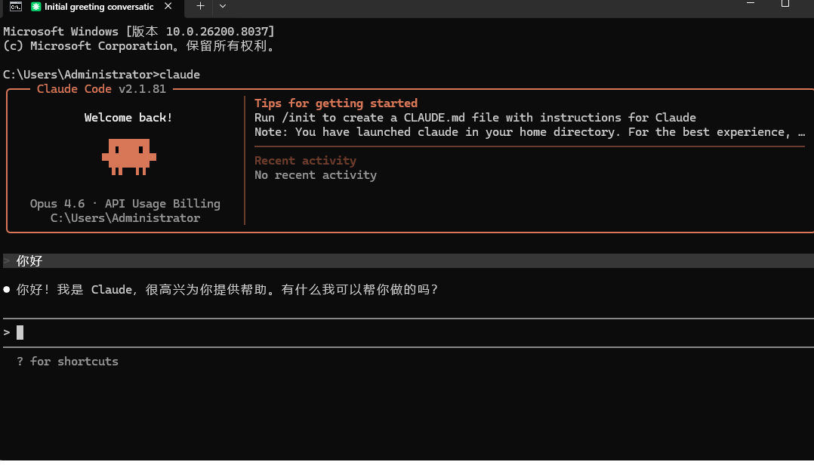
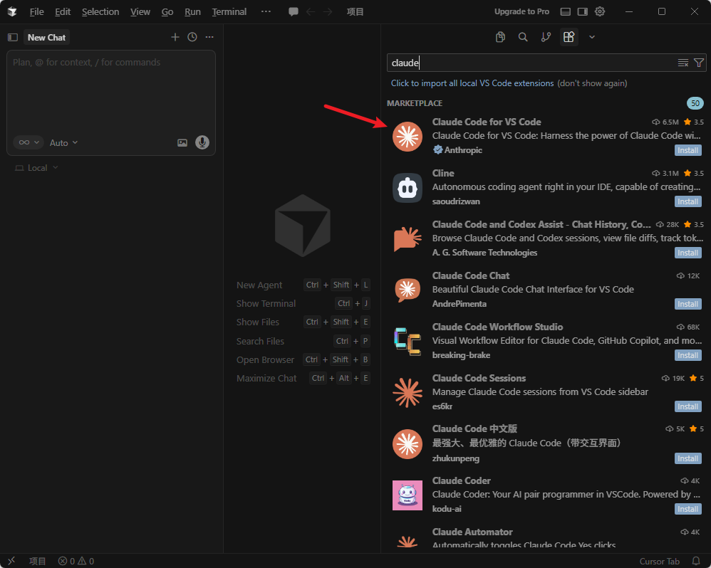
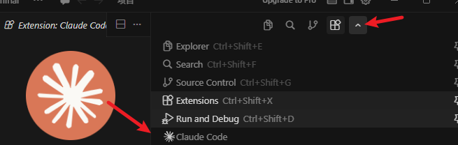
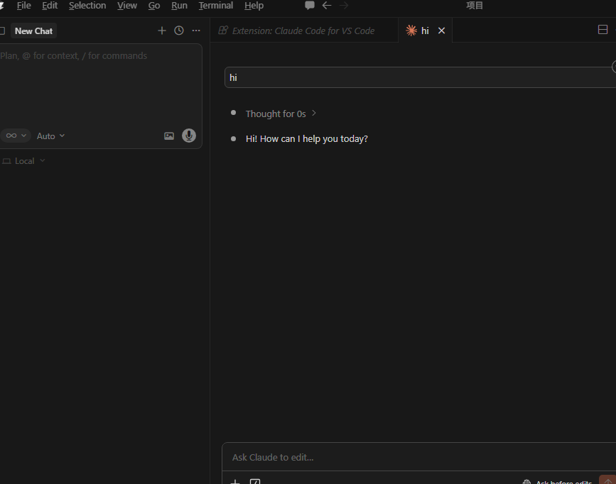

# Cursor接入tokens教程

前置条件：

一个tokens claudecode的令牌key [http://47.102.134.41:3000](http://47.102.134.41:3000)

**安装 Claude Code：**
要安装 Claude Code，请按以下两个流程进行:
**1、本地安装（推荐）**
**macOS, Linux, WSL，Windows PowerShell，Windows CMD:**

```

```
**2、配置本地的sttings.json或者环境变量（二选一如有配置请忽略）**
`settings文件路径 C:\Users\用户名\.claude\settings.json`

```
{
  "env": {
    "ANTHROPIC_AUTH_TOKEN": "sk-hUOgVOGw0qdyk*****************",
    "ANTHROPIC_BASE_URL": "http://47.102.134.41:3000",
    "ANTHROPIC_DEFAULT_HAIKU_MODEL": "claude-opus-4-6",
    "ANTHROPIC_DEFAULT_OPUS_MODEL": "claude-opus-4-6",
    "ANTHROPIC_DEFAULT_SONNET_MODEL": "claude-opus-4-6",
    "ANTHROPIC_MODEL": "claude-opus-4-6",
    "ANTHROPIC_REASONING_MODEL": "claude-opus-4-6"
  },
  "includeCoAuthoredBy": false
}
```

## 2.测试使用cmd输入claude是否能正常对话#

```

```


## 3.cursor安装插件#




## 4.测试#
