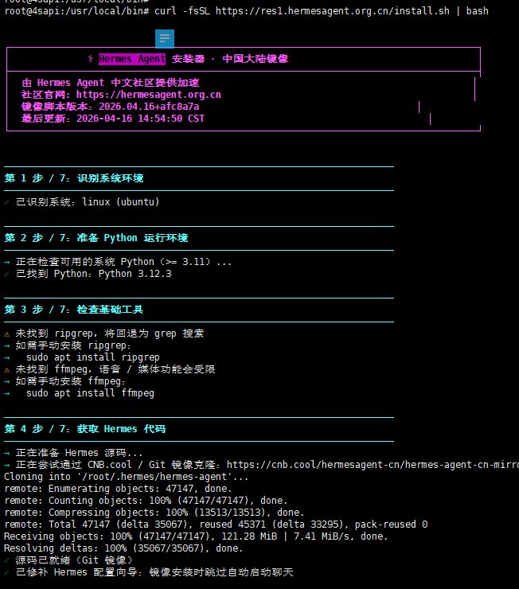
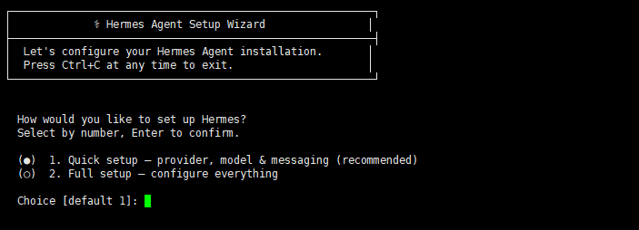
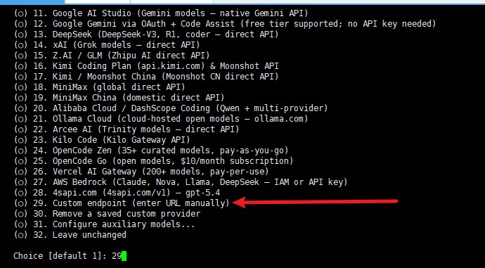
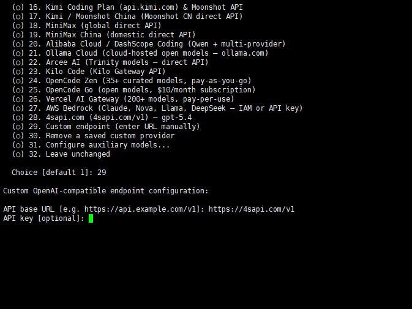
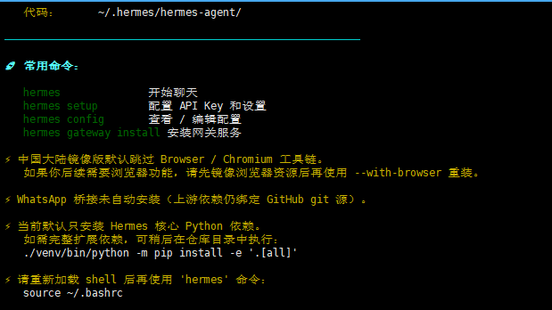
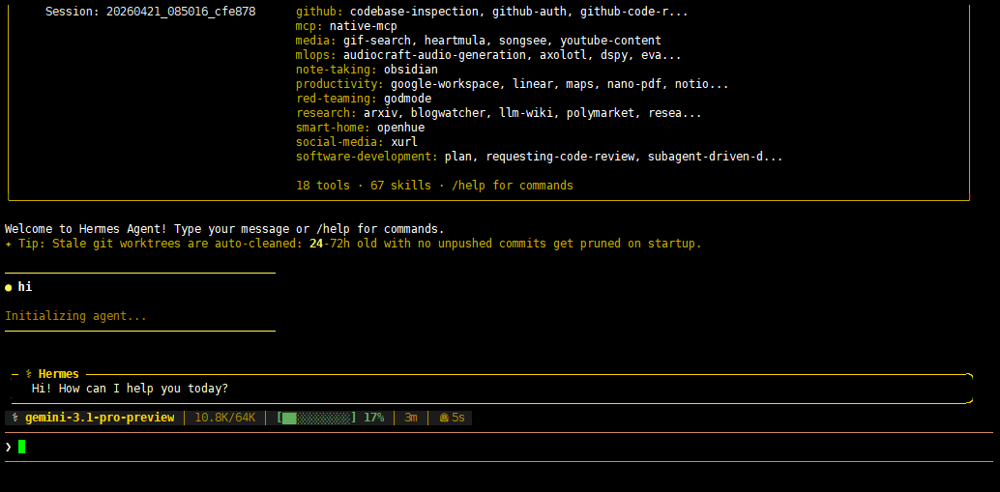

## 1、什么是hermes agent#
`Hermes Agent 是 Nous Research 开发的开源自主 AI 智能体，于 2026 年 2 月发布。它不是绑定在 IDE 上的代码补全工具，也不是套壳聊天机器人——它住在你的服务器上，记住它学到的一切，运行越久能力越强。支持 Linux、macOS 和 WSL2，一条 curl 命令即可安装，无需任何前置依赖。`

## 2、hermes agent快速上手#
`linux 安装命令： curl -fsSL https://res1.hermesagent.org.cn/install.sh | bash`

**因为我此前已经配置过一个了，所以我选择了29，一般的是选择28 Custom endpoint。**

**填入url key 模型id**

`在用户的根目录下
root@tokens:~/.hermes# cd 
root@tokens:~# source ~/.bashrc  //加载环境变量`

