## 1. 这份教程要做什么#
**OpenClaw 负责调用模型**

首先确保你已经安装了 Node.js 24+ 环境，然后在终端执行：

**openclaw安装方式：**

方式一：npm安装（推荐）

```
npm install -g openclaw
```
方式二：一键安装脚本

```

```
安装完成后执行引导（根据提示完成基础设置）
`openclaw onboard --install-daemon`

-选择yes和快速启动

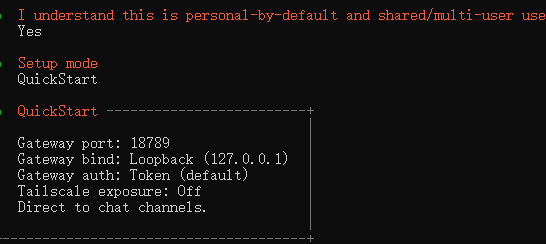

在模型提供商这里选择 Custom Provider

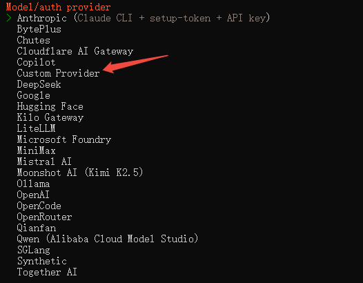

在4spi网站创建令牌，如果已有令牌要检查分组与你要调用的模型是否匹配

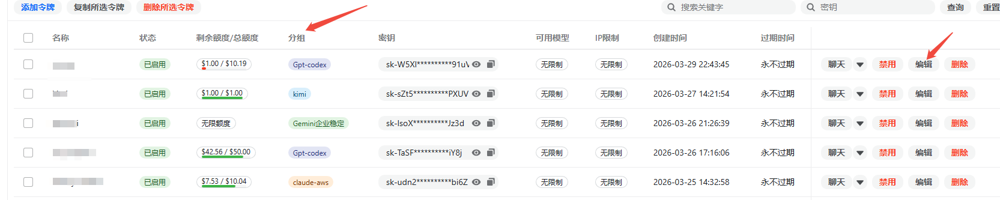

填写URL并粘贴刚才上面令牌的key
**注意**：URL使用：[http://47.102.134.41:3000](http://47.102.134.41:3000)  或者[http://47.102.134.41:3000/v1](http://47.102.134.41:3000/v1)

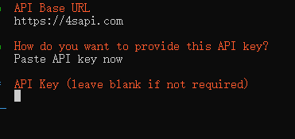

兼容的端点选择要注意，除了claude选择第二个，其他一般选择Open AI兼容

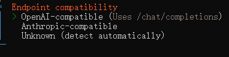

模型名称在模型广场复制

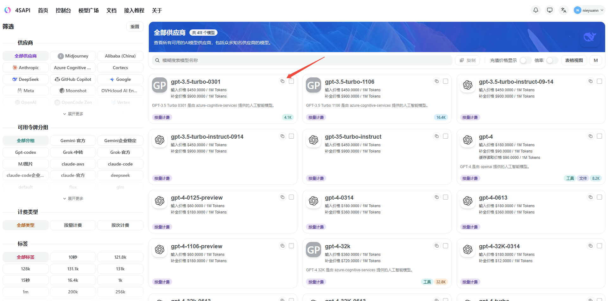

粘贴模型名称

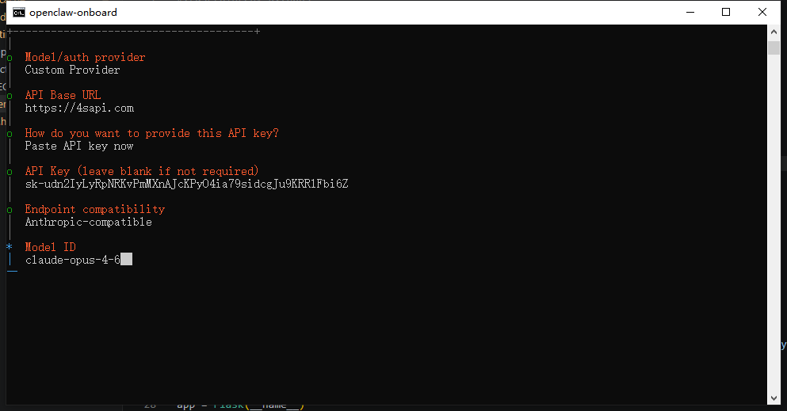

验证成功则为成功连通站点
要是失败，在url后面加个  /v1

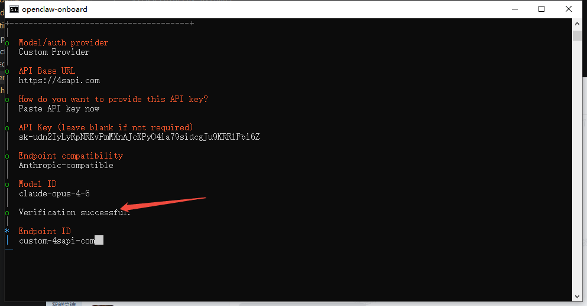

注意有个model alias 是可选，直接回车就可
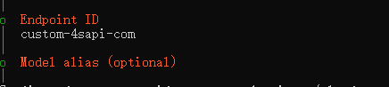

后面选择skip就可

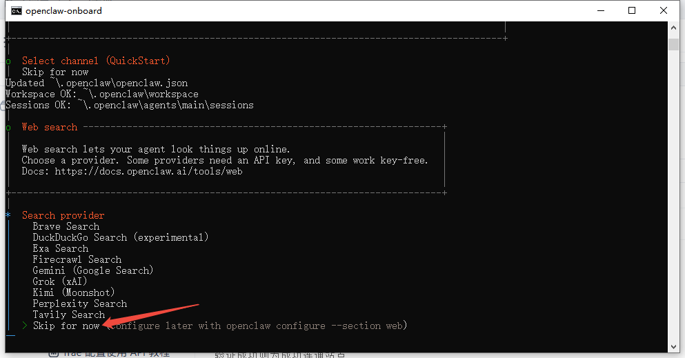

最后重启网关

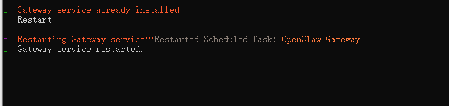

选择web ui

如果不能成功运行，就按下面顺序执行

```
openclaw gateway run
openclaw dashboard
```
成功运行如下
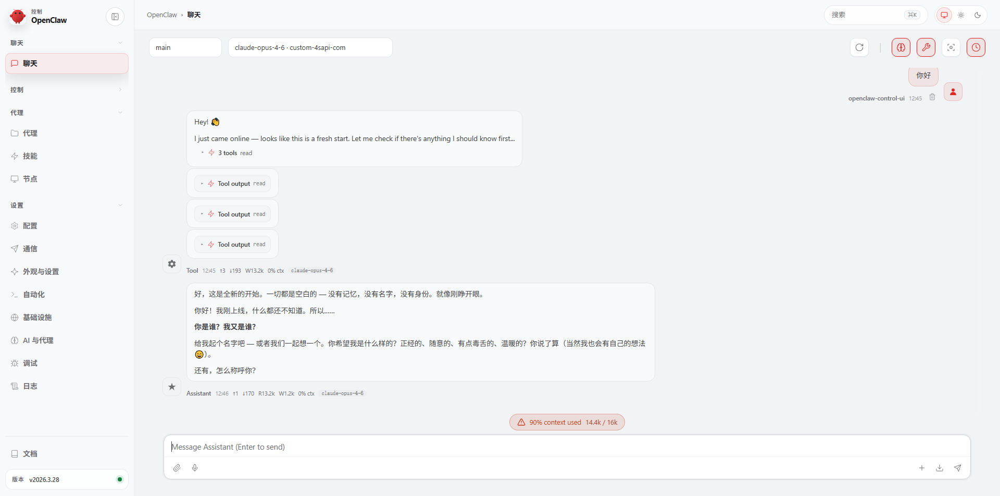

（可选）
如果网关日志报警告上下文窗口过小，可以修改下面配置

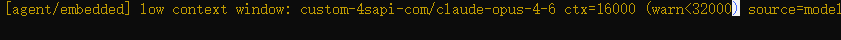

在.openclaw目录下的openclaw.json文件中修改这两个参数

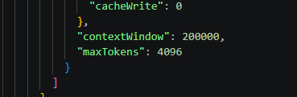