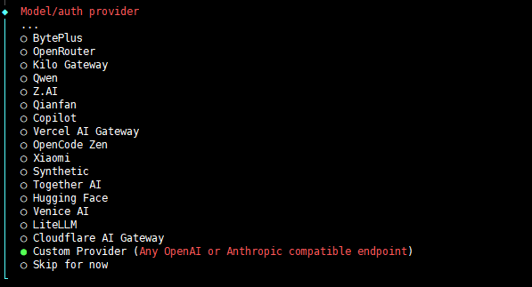
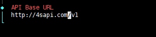
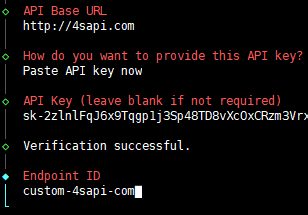
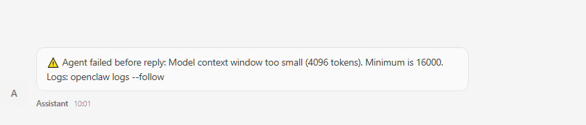
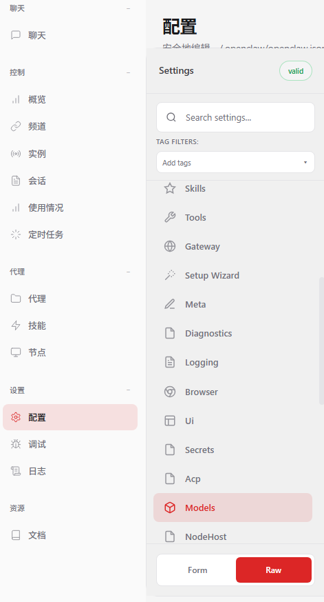
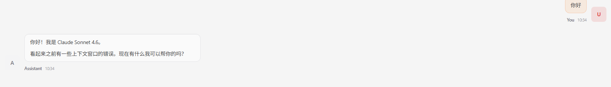

# open claw在云服务器linux环境下通过终端配置api

确保你已经安装了open claw

**1.执行引导（根据提示完成基础设置）**

在终端输入
`openclaw onboard --install-daemon`

**2.选择 QuickStart**

**3.Model/auth povider 选择custom provider**

**4.API Base URL 填写**

**5.粘贴api**

**6.后面全部选择跳过**

**7.关于在打开web ui 后 聊天提示上下文窗口太小问题**

点击**配置**选项点击**models**在下方选择RWA

将contextWindow和maxTokens调大一点

**最后就可以成功运行open claw了**

