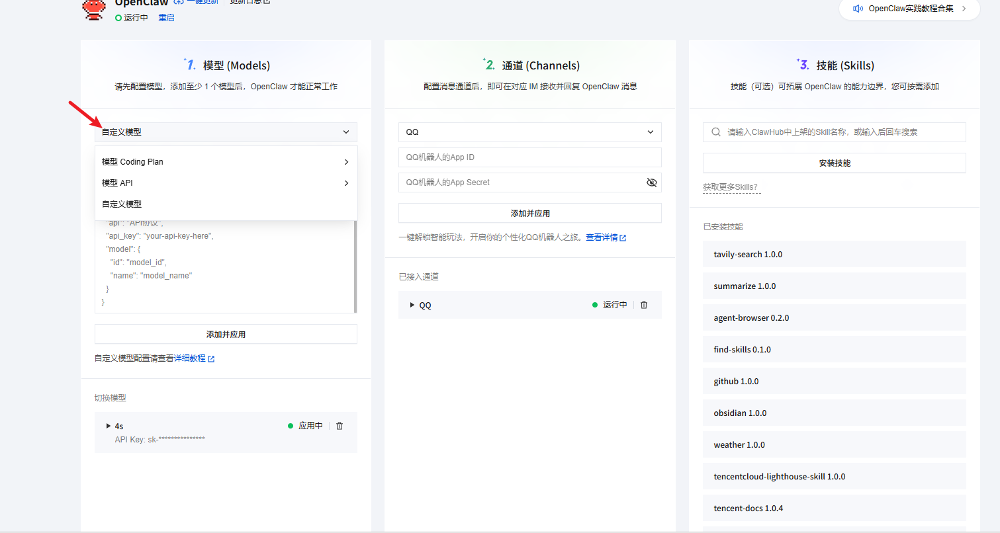
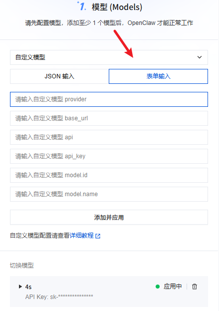
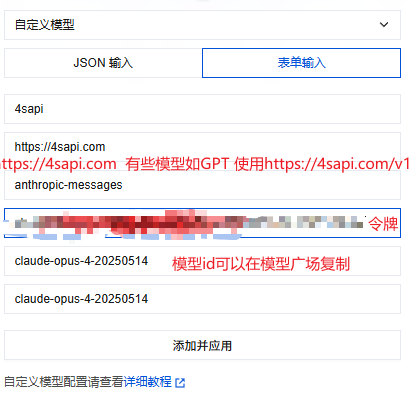
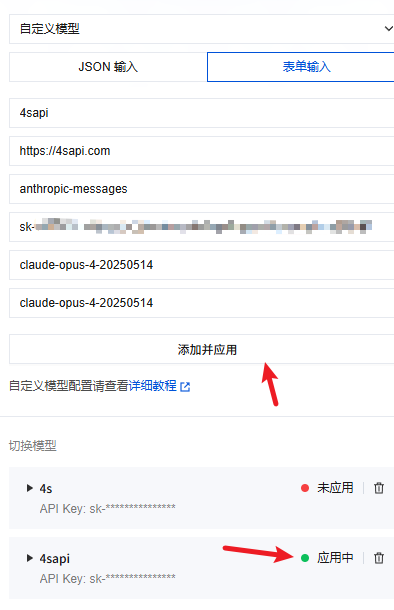
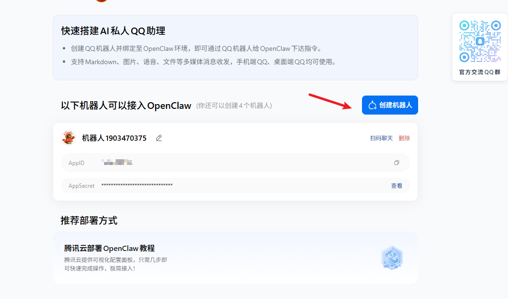
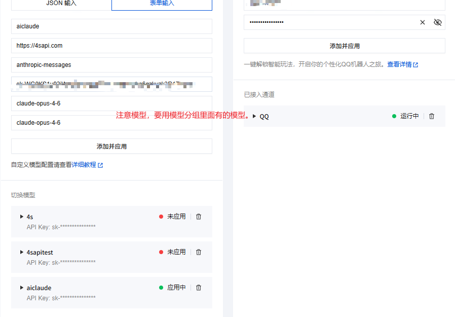
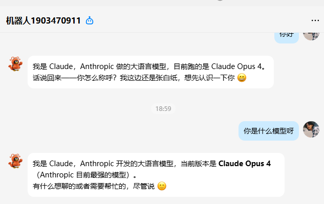

# 腾讯云openclaw接入tokens教程

腾讯云openclaw接入tokens配置qq机器人

## 1.配置模型#

**绿灯亮起表示正常**

## 2.配置通道#

### 2.1配置qq机器人#
进入网址创建机器人：[https://q.qq.com/qqbot/openclaw/index.html](https://q.qq.com/qqbot/openclaw/index.html)

**回到腾讯云添加机器人的id和key**

### 2.2测试qq机器人#

**参考文档**： [https://clawd.org.cn/channels/qqbot](https://clawd.org.cn/channels/qqbot)