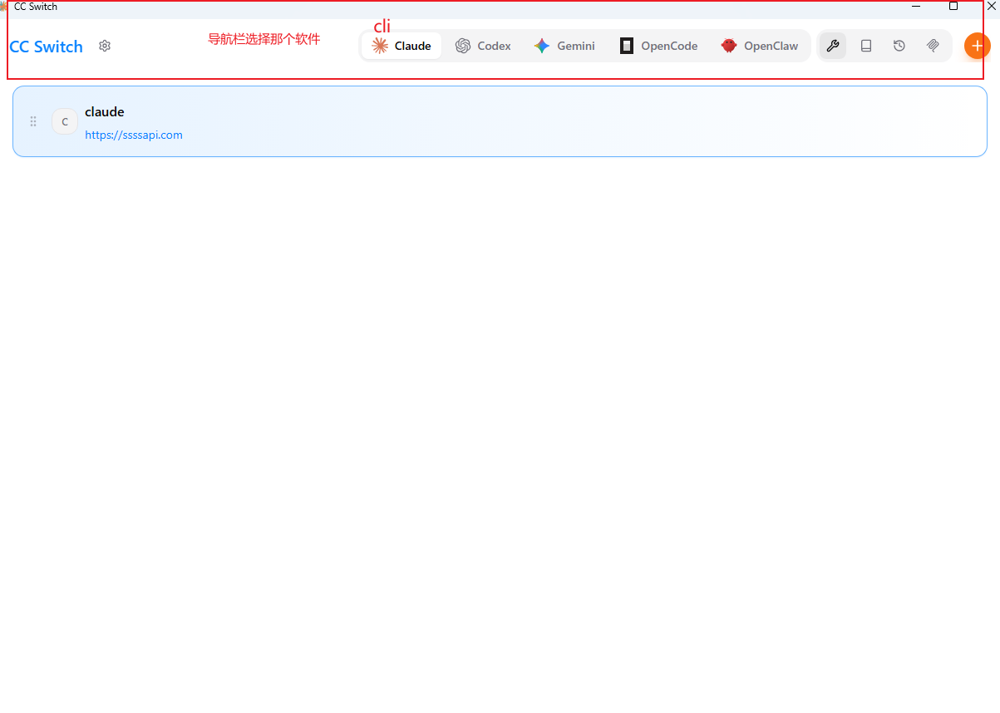
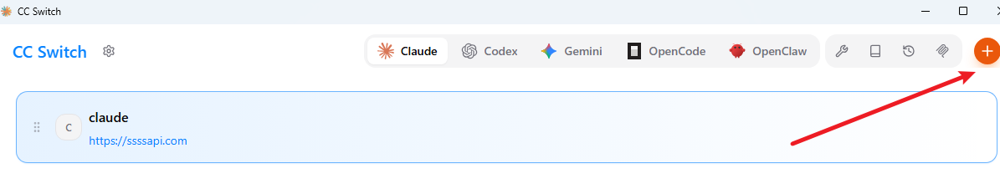
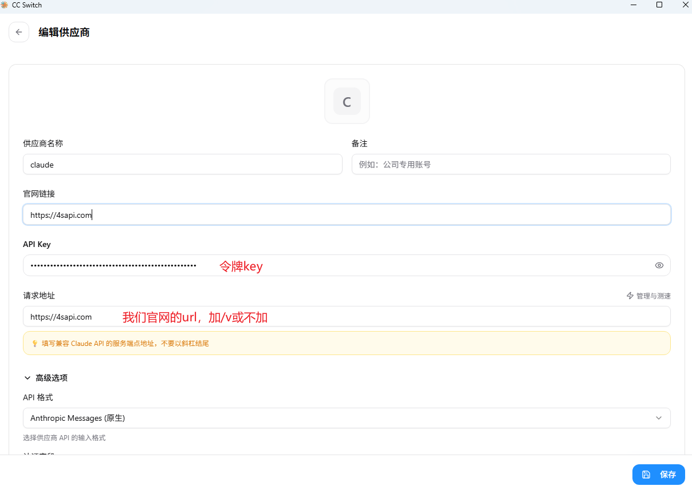
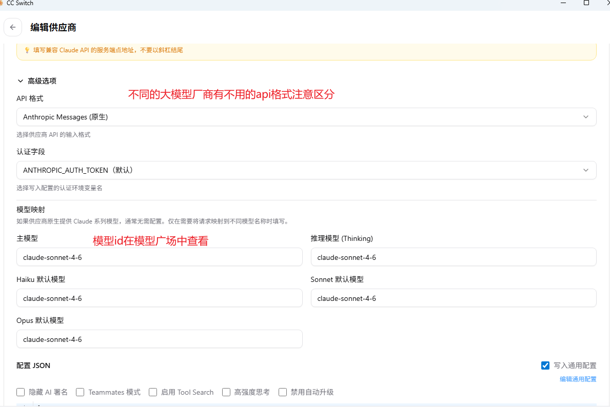

# cc switch使用教程


## 工具概述#


```js
CC Switch 是一个基于 Rust 和 Tauri 构建的轻量级（约 6MB）桌面应用，旨在解决频繁手动修改 CLI 配置文件、切换不同 API Key 或代理地址的痛点。

支持工具：Claude Code, Codex, Gemini CLI, OpenCode, OpenClaw 等。

支持系统：Windows 10+, macOS 12+, Linux (Ubuntu/Debian/Fedora)。

核心优势：一键切换配置、系统托盘快速操作、云同步、MCP 协议支持。
```


# 1、下载安装 CCS#

**项目地址：**[https://github.com/farion1231/cc-switch](https://github.com/farion1231/cc-switch)

# 2、配置CCS#








## 2.1 配置样例1 （claude）#






点击保存