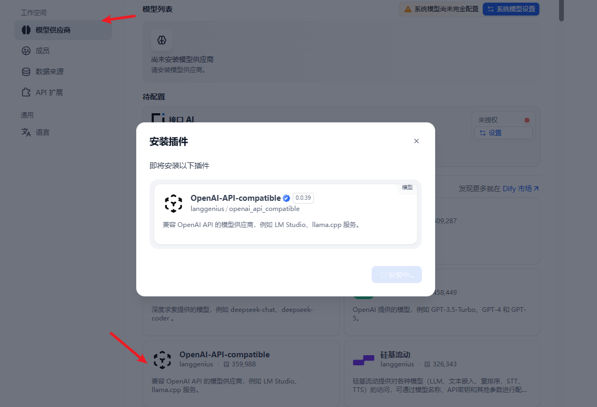
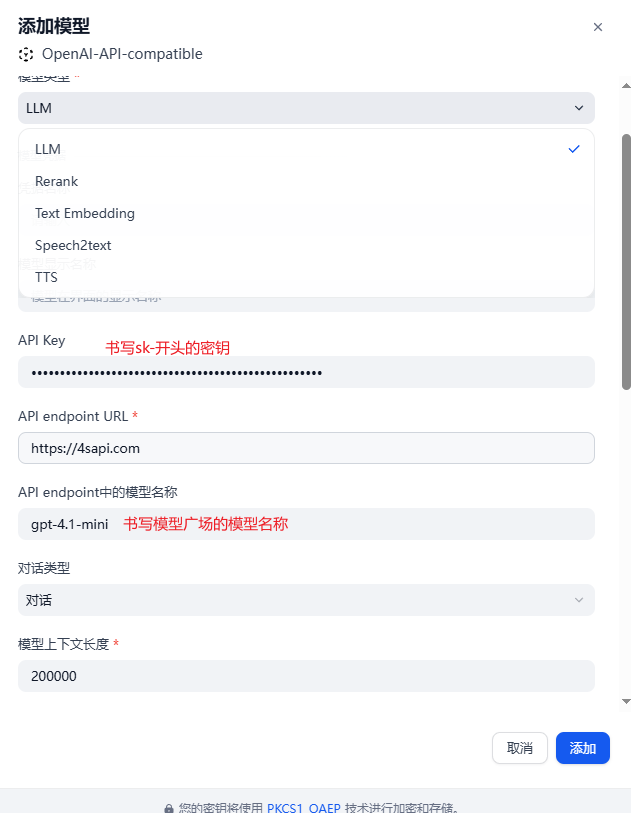
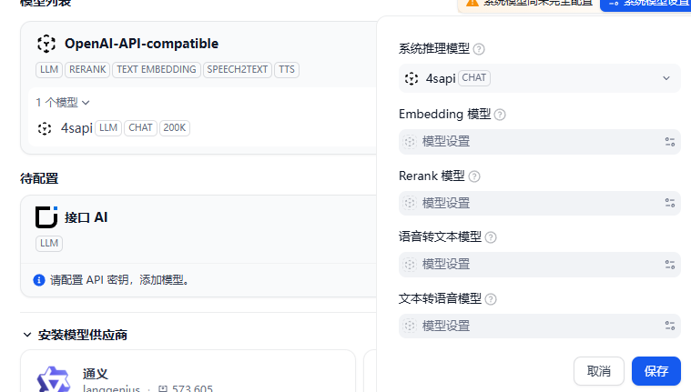
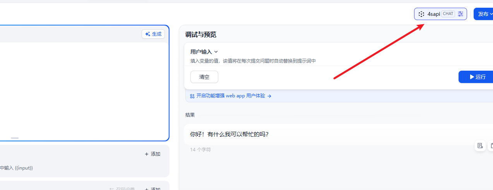
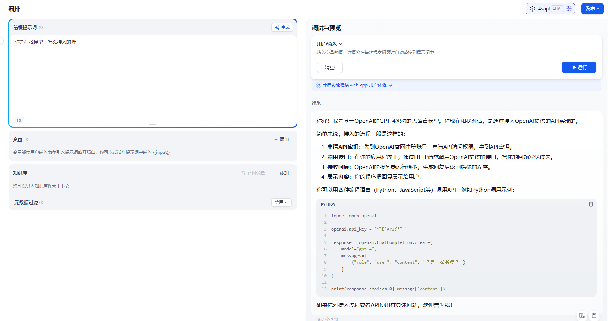

# Dify 配置使用教程


## 1.Dify 基本介绍#

**Dify**是一个开源的大语言模型（LLM）应用开发平台，它致力于为开发者提供一站式、低代码甚至无代码的 AI 应用开发体验。**Dify**核心目标是降低 AI 应用开发门槛，支持从原型设计到生产部署的全流程管理，它拥有直观的可视化界面，开发者无需深入底层代码，只需通过简单的拖拽、配置操作，就能定义应用的 Prompt（提示词）、上下文以及各种插件。

## 2.Dify 设置#

登陆**Dify**后，点击右上角个人中心下拉菜单，点击**设置**。

### 2.1Dify 添加供应商#

在**Dify**显示的**设置**页面中，在左侧栏点击**模型供应商**，在页面右栏**模型供应商**列表显示中央，点击**添加模型**，如下图所示。




### 2.2 Dify 配置模型#

在**模型类型**中选择**LLM**，然后配置模型名称，在下面的**API Key**中填写你在 n1n 平台创建的**令牌**中的**Key**，在**API endpoint URL**中填写 n1n 平台的接口地址，点击**保存**，然后就可以在列表中看到我们刚添加的模型了。
n1n 平台接口地址：

```
API endpoint URL：https://tokens.smartfashionai.cn/ 或者 https://tokens.smartfashionai.cn//v1
```

示例如下所示：







### 2.3Dify 中使用添加的模型#

在**Dify**聊天对话框的右上角，选择我们刚才添加的模型就可以进行使用了，如下所示。





