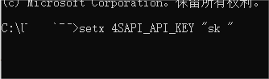
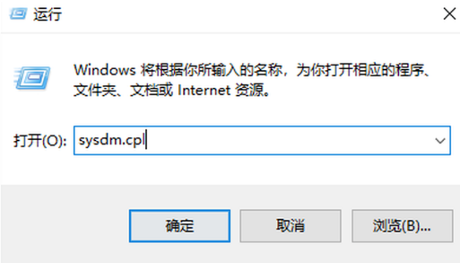
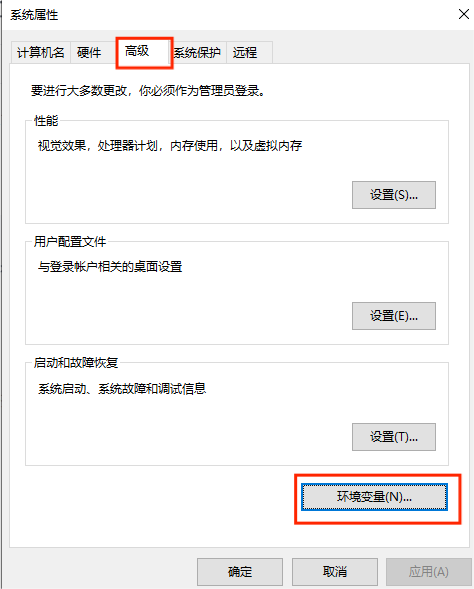
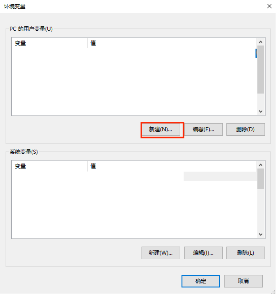
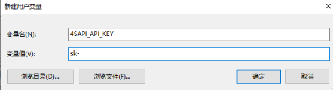
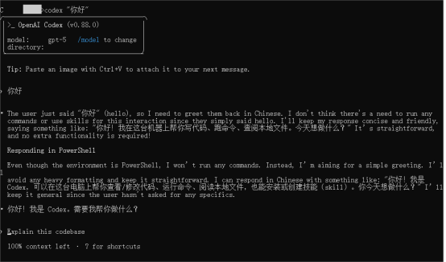

# GPT-codex安装教程


前置条件：
一个4sapi GPT-codex的[密钥/令牌（key）](http://47.102.134.41:3000)
**安装 GPT-codex：**要安装 GPT-codex，请按以下两个流程进行:**1、本地安装（推荐）****macOS, Linux, WSL，Windows PowerShell，Windows CMD:**

```bash
npm i -g @openai/codex
```

**2、环境变量配置**
自定义api与key(win)自定义api与key(mac)
## 1、Codex配置#
创建配置文件config.toml你可以用电脑有的编辑器，比如 nano、vim、code（VS Code）等，也可以直接在.codex目录下直接创建config.toml文件。**在安装的目录下运行以下代码：**
#### code .codex/config.toml#

### 在config.toml中粘贴如下配置，再根据需求修改：#

```bash
#全局默认配置
model_provider = "Tokens"
model = "gpt-5"  # 调用的模型，请确保该模型 ID 在 Tokens 控制台中存在

#Tokens 模型供应商配置
[model_providers.Tokens]
name = "Tokens"
base_url = "http://47.102.134.41:3000/v1"
env_key = "4SAPI_API_KEY"  #请不要把4sAPI的key放到这里，不要修改这里
wire_api = "responses"  
query_params = {}
request_max_retries = 3
stream_max_retries = 8
```

## 2、添加apikey环境变量#

#### 方式一：使用命令行 (习惯命令行)#
Windows命令提示符（CMD）和PowerShell都可以做到，推荐使用 setx命令。setx用于永久性地设置环境变量。重要提示：setx会将变量写入注册表，它会影响未来打开的所有命令提示符窗口，但不会影响当前的窗口。因此，你需要操作之后重新打开一个新的终端窗口(win+R,输入cmd回车)：用 setx 进行永久设置 (相当于编辑 .bashrc)操作步骤 (在CMD中打开并执行):设置第一个变量setx 4SAPI_API_KEY "sk "
```bash
setx 4SAPI_API_KEY "sk "
```


重要：设置完成后，你需要关闭所有已经打开的CMD或PowerShell窗口，然后重新打开一个新的窗口，这样新的环境变量才会生效。
#### 方式二：使用图形用户界面 (GUI) (推荐给所有Windows用户)#
这是最直观、最不容易出错的方法。打开“系统属性”按键盘上的 Windows 键 + R 键，打开“运行”对话框。输入 sysdm.cpl 然后按回车。
```bash
sysdm.cpl
```


进入“环境变量”设置在打开的“系统属性”窗口中，切换到“高级”选项卡。点击右下角的“环境变量...”按钮。

添加新的用户变量在弹出的“环境变量”窗口中，上半部分是“(您的用户名) 的用户变量”。点击“新建(N)...”按钮。变量名(N): 4SAPI_API_KEY变量值(V): sk-... (你的密钥)点击“确定”。



保存并关闭在“环境变量”窗口点击“确定”。在“系统属性”窗口点击“确定”。重要：通过GUI设置完成后，你需要关闭所有已经打开的CMD或PowerShell窗口，然后重新打开一个新的窗口，这样新的环境变量才会生效。**打开GPT-codex方法：打开一个新终端，输入codex "你好"后回车，当出现类似下面为配置成功可以正常使用。**


**开始使用 GPT-codex：**打开一个新终端，输入codex后回车。

```bash
cd your-project
codex
```
