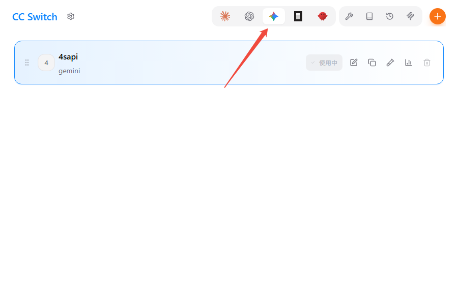
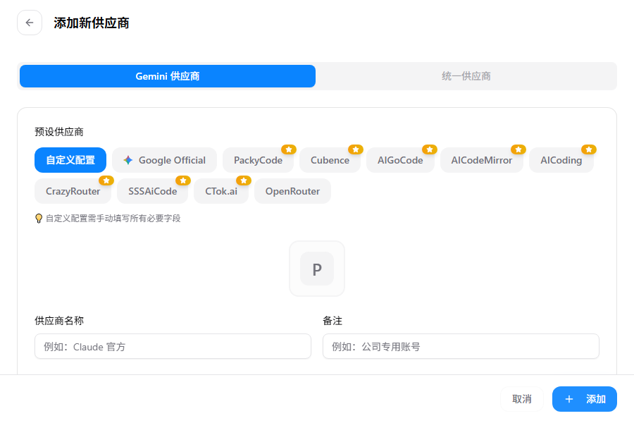
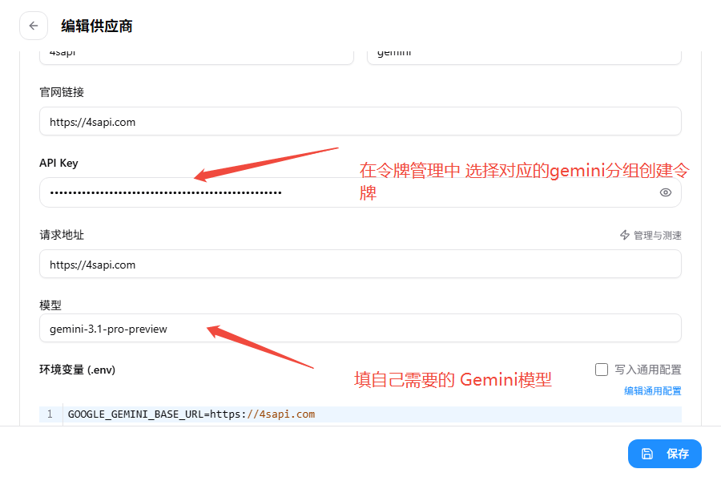
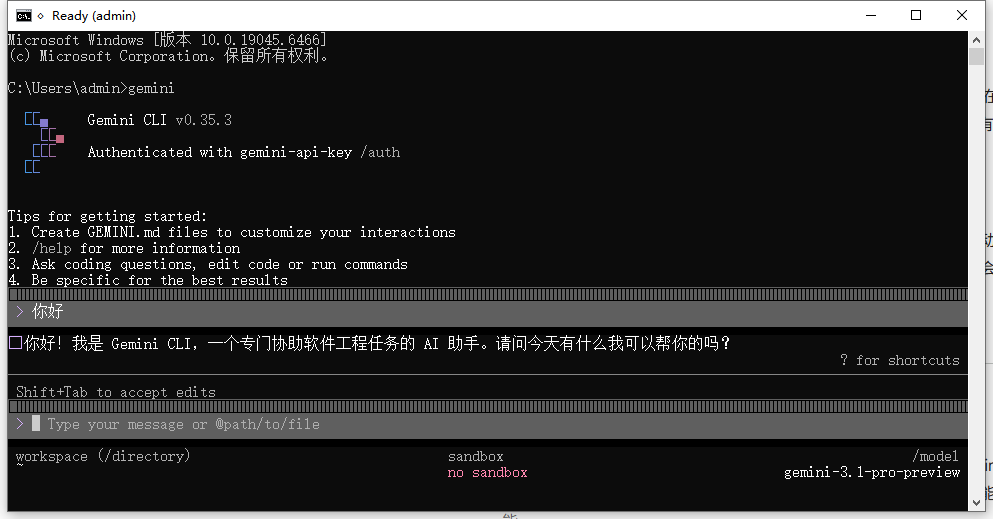

# gemini cli 配置教程

**前提条件**
已安装 Node.js 18 或更高版本（可通过 node -v 查看当前版本）。
**使用全局安装的方法**
在“终端”里输入如下命令行，然后按回车键运行（使用 sudo 时会提示你输入当前用户的密码）：

```
npm install -g @google/gemini-cli

// 或（适用于 Mac）

sudo npm install -g @google/gemini-cli
```

**配置 cc switch**下载 cc switch地址`https://github.com/farion1231/cc-switch/releases/tag/v3.12.3`往下拉，找到适合自己系统的版本
安装完成后打开cc switch 点击上方gemini图标



点击右上角的加号后选择自定义供应商



完整配置如下



最后 打开终端输入`gemini`就可以聊天了


