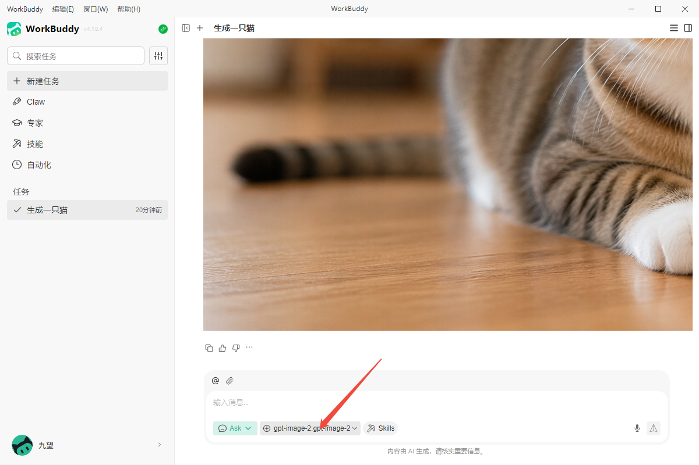
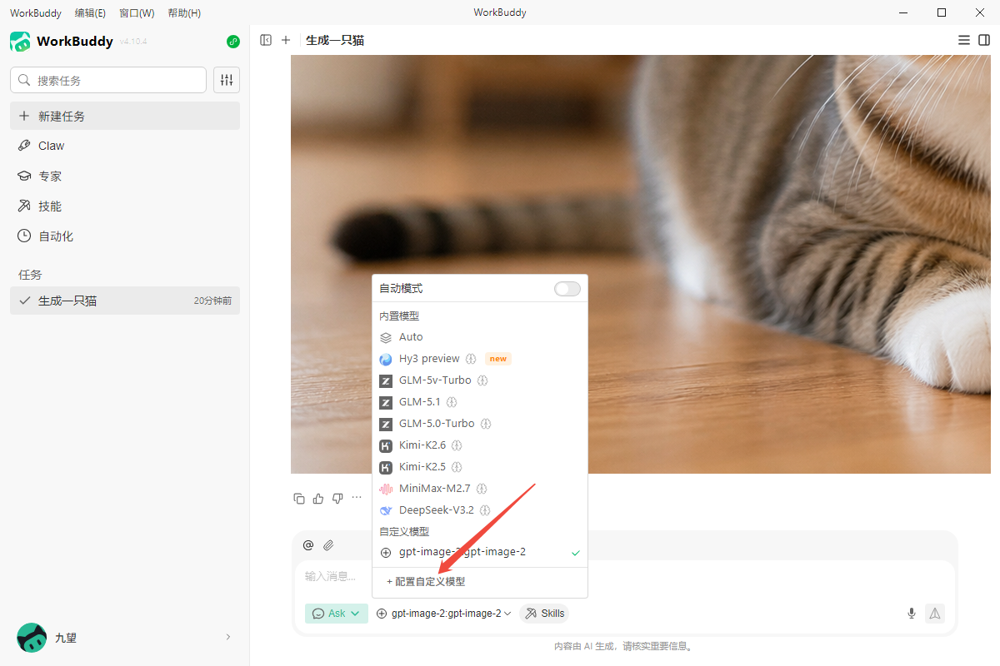
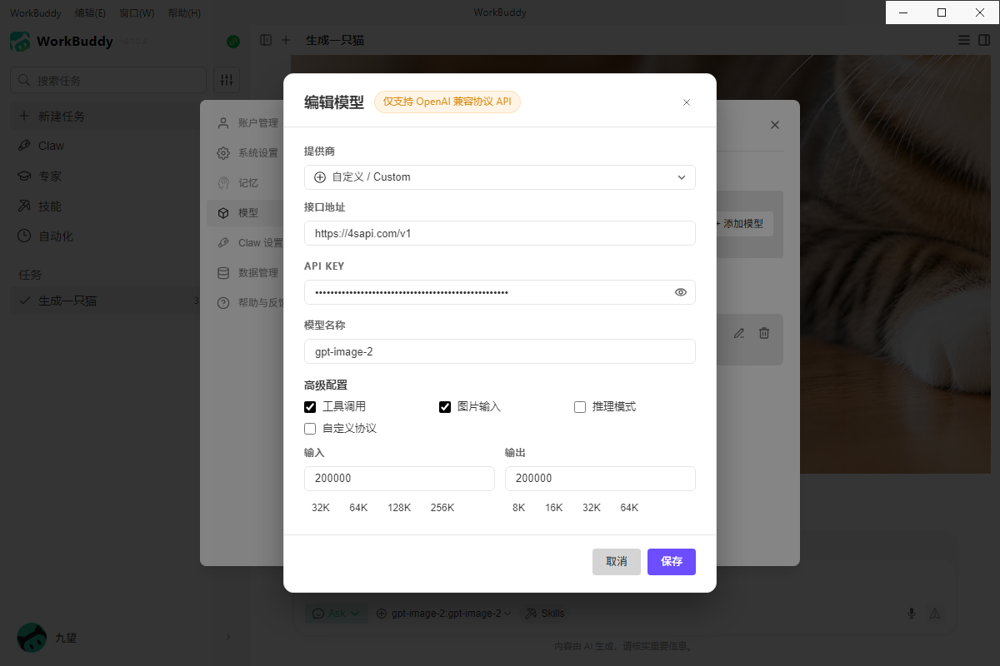
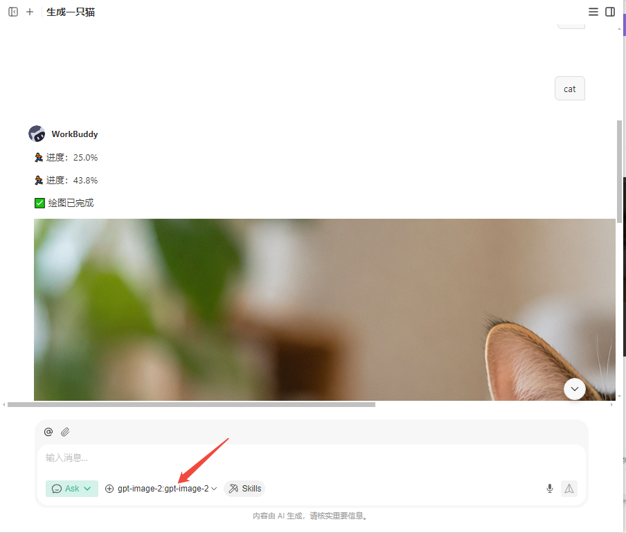

# WorkBuddy 接入4sapi教程

本教程在windows环境下配置，以下截图也是windows为例
下载workbuddy

## 1.打开登录WorkBuddy 在主界面 点击模型#

选择自定义模型

## 2.配置模型（以gpt-image-2 生图模型为例）#

按照下图所示填写表单

点击保存即可

## 3.运行示例#

选择刚才配置好的模型 并输入提示词发送就可生成内容

### 如果在模型列表找不到模型，则退出软件重新进即可#

