# n8n配置使用教程

**一.添加账户凭证**1.在n8n中点击overview，再点击Credential

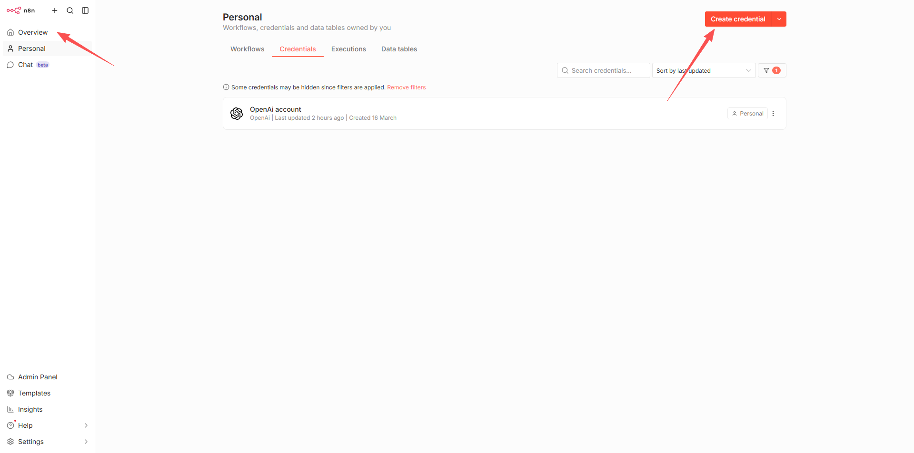

2.在弹出的窗口中选择OpenAi

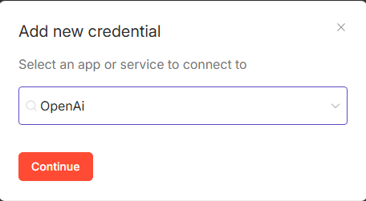

3.在弹出的界面中填入下面信息

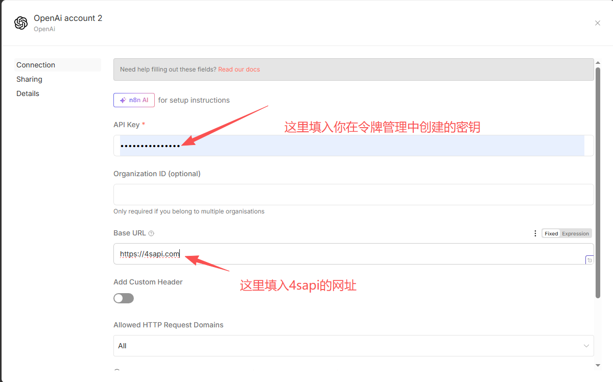

4.点击保存后出现以下信息则成功

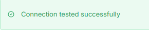

**二.n8n 工作流配置第三方 API**通过http request添加：1.创建工作流

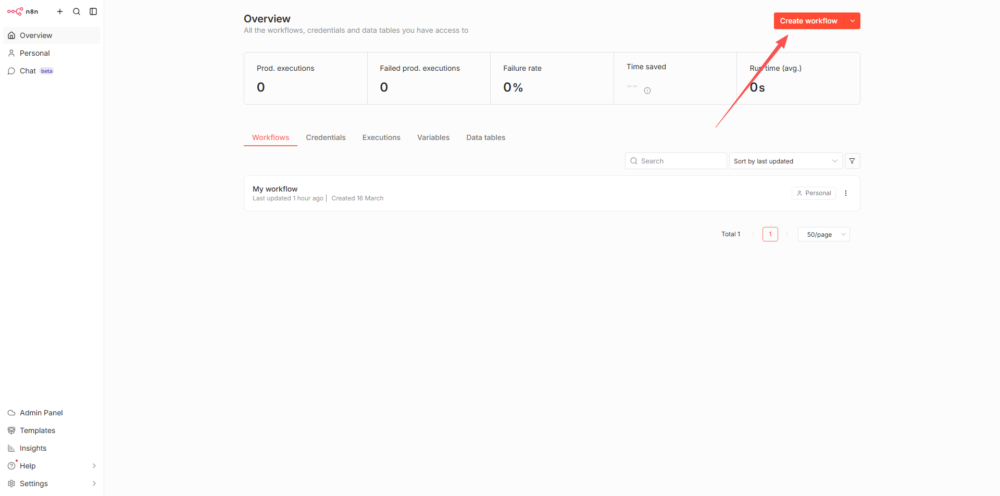

2.选择手动触发

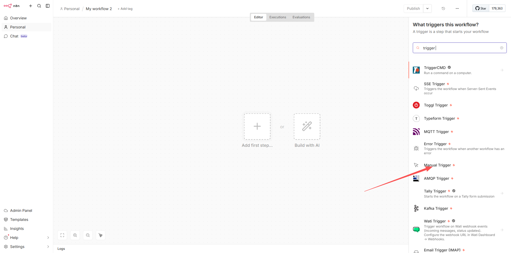

3.添加下一个 n8n 工作流模块，选择 HTTP Request 节点

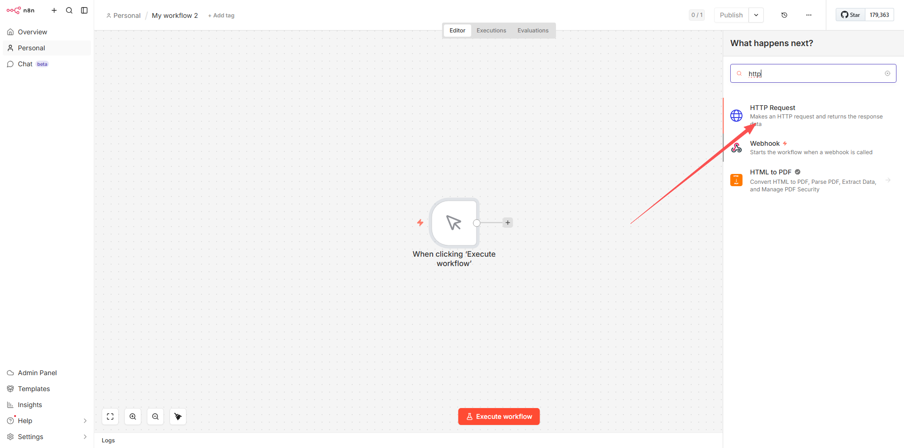

4.按照下图信息填写
都使用json格式

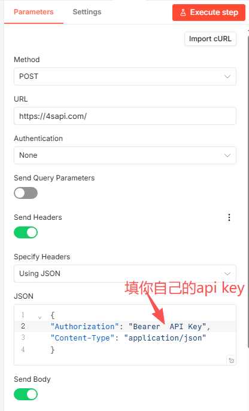

`{
"Authorization": "Bearer  API Key",
"Content-Type": "application/json"
}`

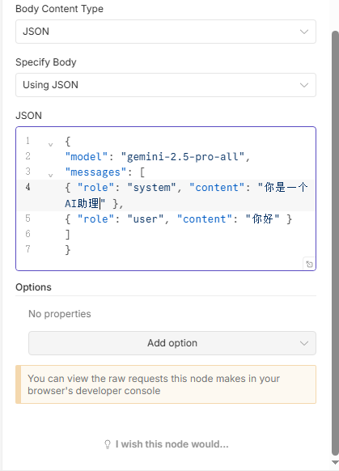

`{
"model": "gemini-2.5-pro-all",
"messages": [
{ "role": "system", "content": "你是一个AI助理" },
{ "role": "user", "content": "你好" }
]
}`
5.点击顶部的 Execute step 进行测试，如果右边 OUTPUT 正常输出内容了，说明 n8n 节点配置成功执行了
**三.n8n 生图工作流节点配置**1.添加 HTTP Request 节点来配置第三方 API

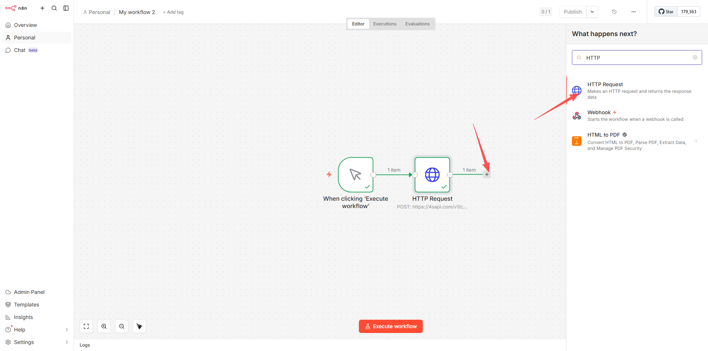

2.按照下图填入信息

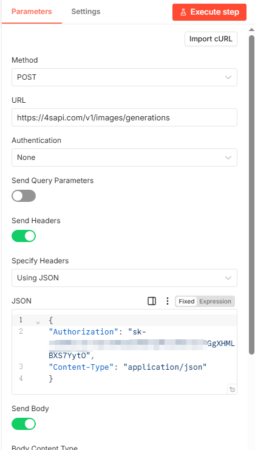

`{
"Authorization": "sk-",
"Content-Type": "application/json"
}`

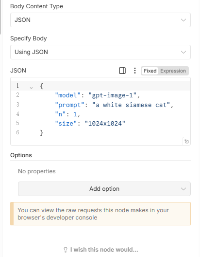

`{
    "model": "gpt-image-1",
    "prompt": "a white siamese cat",
    "n": 1,
    "size": "1024x1024"
}`
3.点击右上角测试，输出成果就可以了

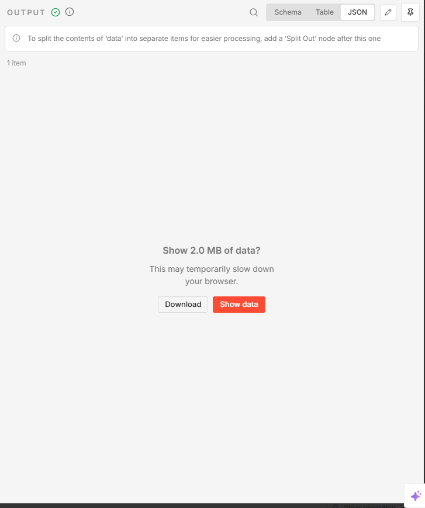

4.输出可以通过在线转码转成图片

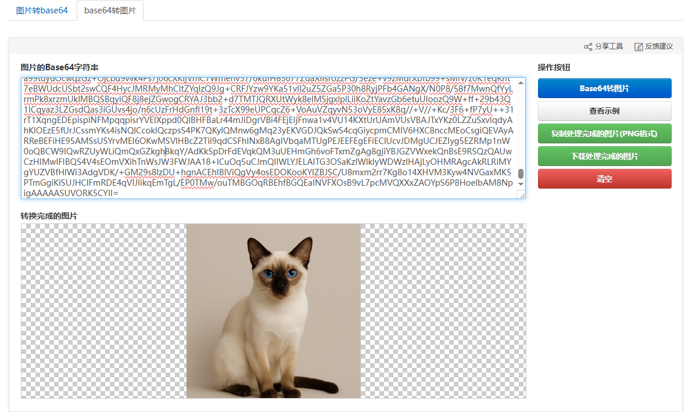
