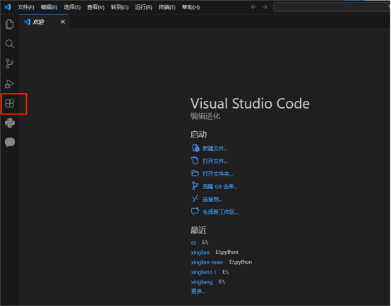
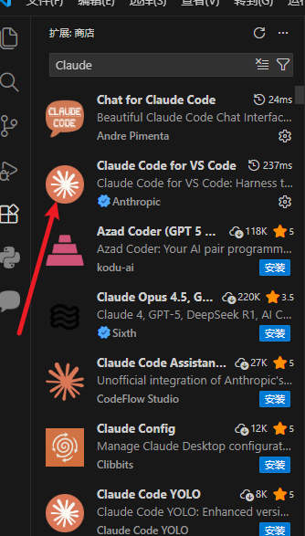
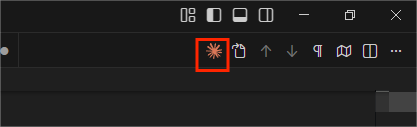
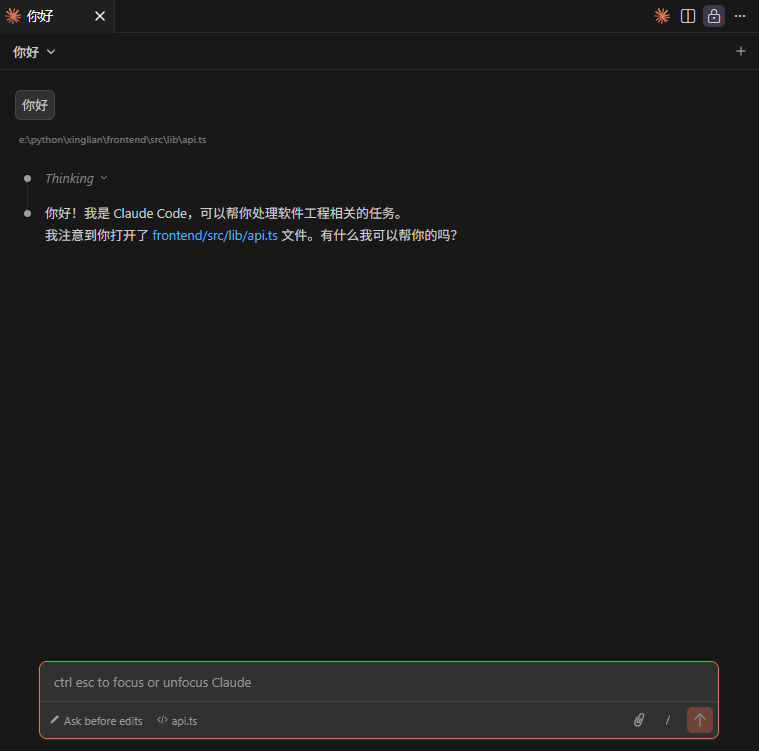

# VScode配置使用教程

!!! warning
    一个 claudecode 的令牌key [https://tokens.smartfashionai.cn/](https://tokens.smartfashionai.cn/)

## 1.安装 Claude Code：

**要安装 Claude Code，请按以下两个流程进行:**

### 1.1 本地安装（推荐）

**macOS, Linux, WSL，Windows PowerShell，Windows CMD:**

```bash
npm install -g @anthropic-ai/claude-code
```

### 1.2 配置本地的sttings.json或者环境变量

=== "windows 平台"

    ```
    settings文件路径 C:\Users\用户名\.claude\settings.json
    ```

=== "mac 平台"
  
    ```
    settings文件路径 ~/.claude/settings.json
    ```

```json
{
  "env": {
    "ANTHROPIC_AUTH_TOKEN": "sk-hUOgVOGw0qdyk*****************",
    "ANTHROPIC_BASE_URL": "https://tokens.smartfashionai.cn/",
    "ANTHROPIC_DEFAULT_HAIKU_MODEL": "claude-opus-4-6",
    "ANTHROPIC_DEFAULT_OPUS_MODEL": "claude-opus-4-6",
    "ANTHROPIC_DEFAULT_SONNET_MODEL": "claude-opus-4-6",
    "ANTHROPIC_MODEL": "claude-opus-4-6",
    "ANTHROPIC_REASONING_MODEL": "claude-opus-4-6"
  },
  "includeCoAuthoredBy": false
}
```

## 2.测试使用cmd输入claude是否能正常对话

```js
注意！！！claude code会自动读取文件夹下的文件，建议一个空文件夹测试。防止消耗大量token
```


**安装 VScode插件（Claude Code for VS Code）：**

## 3.打开VScode的扩展





## 4.在扩展商城中搜索Claude，就会出现许多相关插件





## 5.打开插件,按照上面流程配置好Claude即可使用#






