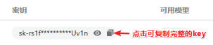
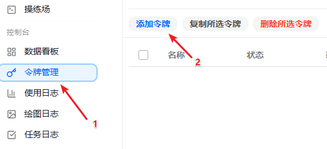
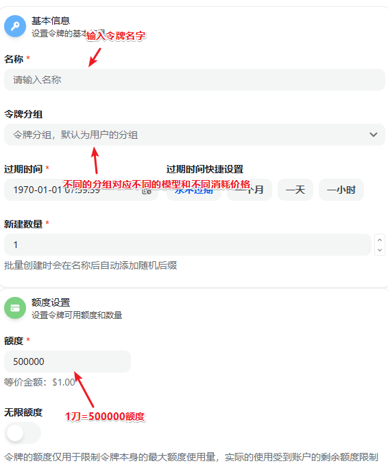
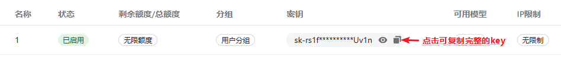
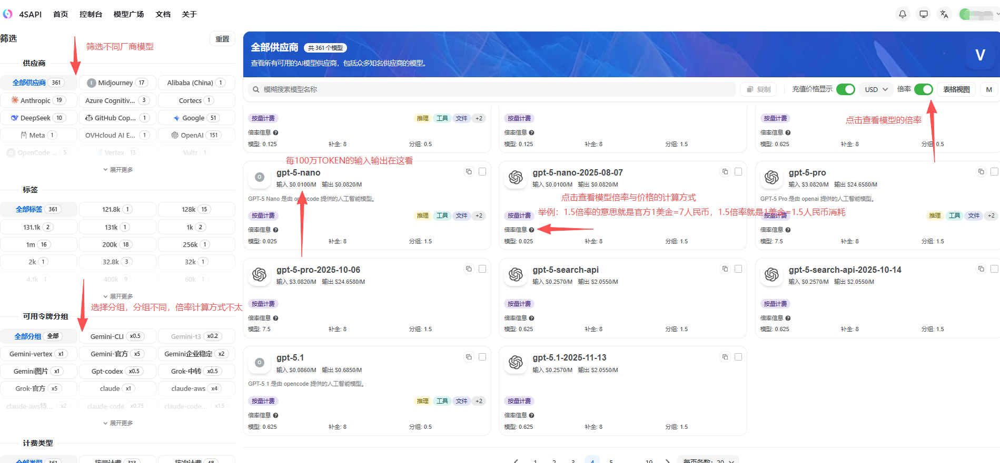
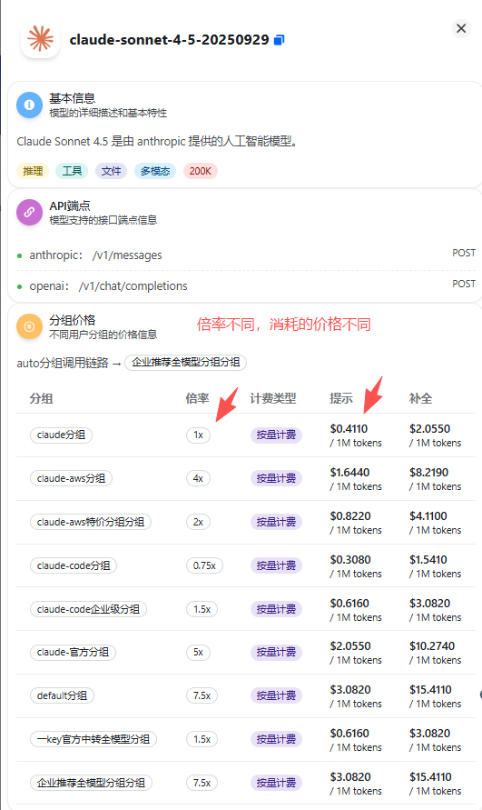
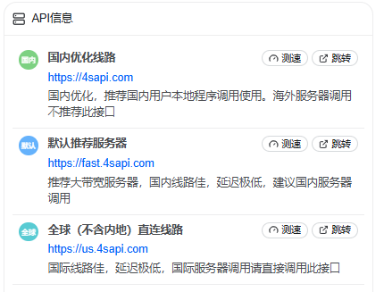

# 站点操作指南-快速上手调用大模型API

!!! tip "新用户必看"
    api站：[https://tokens.smartfashionai.cn/](https://tokens.smartfashionai.cn/)
    
    **注册用户--充值余额--创建令牌--选择需要调用大模型相对应的分组--令牌额度/期限设置--完成创建
    API=URL+令牌**

    **URL:[https://tokens.smartfashionai.cn/](https://tokens.smartfashionai.cn/)** 
    **秘钥：SK-xxxxxxxxxxxxxxxxxxxxxxxxxxxxxx**
    

!!! warning "新用户必看"
    🎁 新用户必看文档。
    如有其他疑问或企业级客户需要工作人员协助，请联系微信：xiaochaozhz 。    

!!! warning "配置模型"
    在模型广场选择对应模型名称，需要复制，不要打错模型名字，必须一致。例如：claude-sonnet-4-5-20250929
    (根据调用的模型查看技术文档，确定是否需要加v1等)

## 1. 充值

进入「控制台」页面，选择左侧栏的「钱包管理」 ，根据实际需求进行充值，确保账户余额 大于 0

## 2. 创建 API Key

a. 选择左侧栏的「密钥管理」，点击「添加令牌」

b. 填入令牌名称，根据实际需求选择分组和设置额度，最后点击下方的提交按钮后即可生成key

c. 生成后，可以看到该key的状态，余额，分组等信息

d. 其中不同分组可用的模型和对应的消耗价格可从「模型广场」中查看

e. 点击模型名字可查看该模型的详细信息

**分组区别：资源渠道不同，稳定性不同，质量不同，具体结合自己使用需求选择性价比最高的资源，也可以联系客服经理协助选择分组**

## 3. 获取中转信息

在控制台页面右侧可看到我们不同的站点信息，可根据自己的网络情况选择不同的站点

## 4. 使用方法

使用时，把之前步骤生成的key放在http请求的头部(Header)进行鉴权，并根据不同模型不同接口的格式向指定接口地址 [https://tokens.smartfashionai.cn/](https://tokens.smartfashionai.cn/) 发送请求。

!!! warning "提示"
    在一些第三方软件或平台输入自定义 URL 时，可能需要追加 /v1 或 /v1/chat/completions。具体URL可从模型广场页面点击模型查看该模型对应的api端点
    如：[https://tokens.smartfashionai.cn/](https://tokens.smartfashionai.cn/)
    [https://tokens.smartfashionai.cn/v1](https://tokens.smartfashionai.cn//v1)   （最常见）
    [https://tokens.smartfashionai.cn/v1/chat/completions](https://tokens.smartfashionai.cn//v1/chat/completions)

